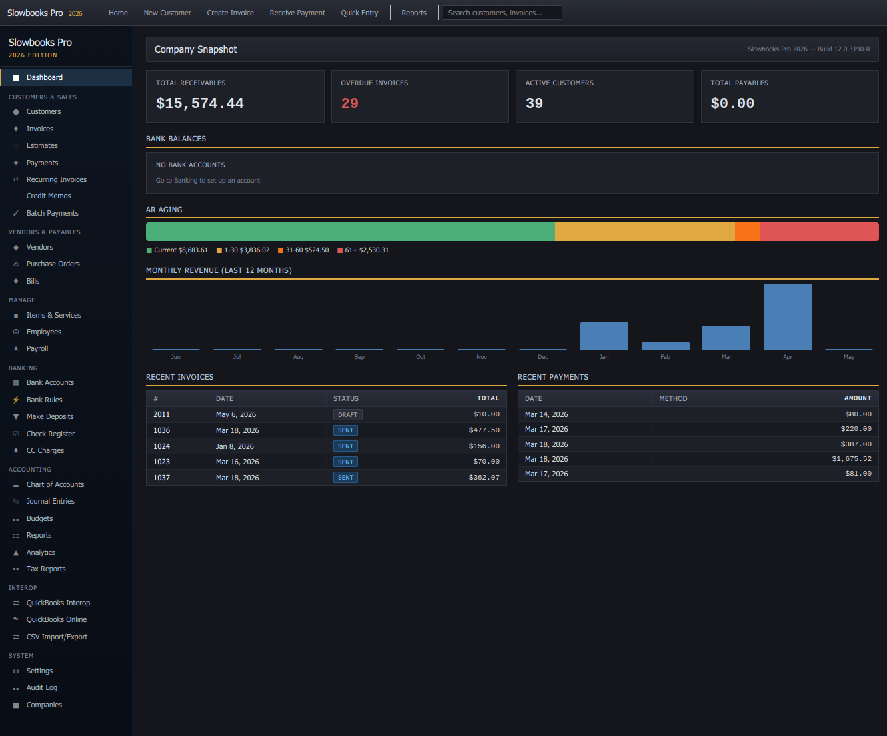
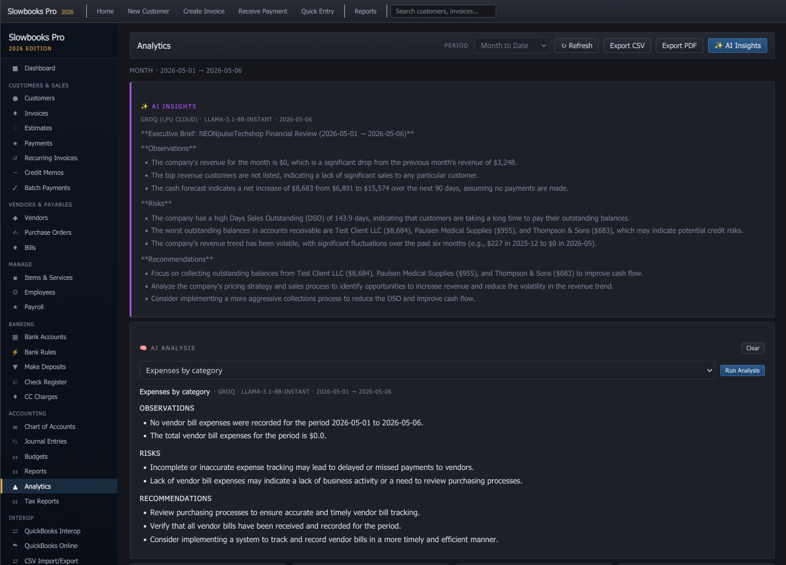
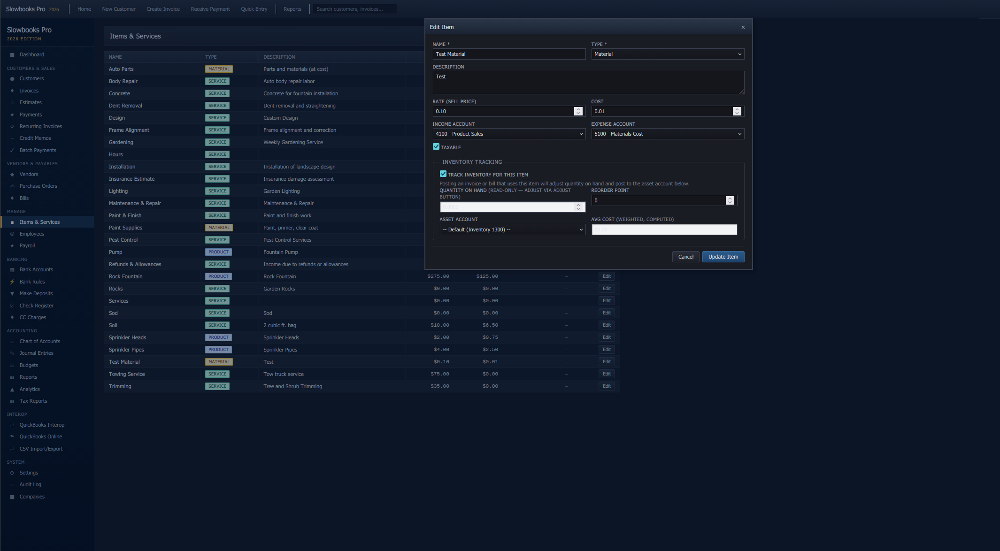
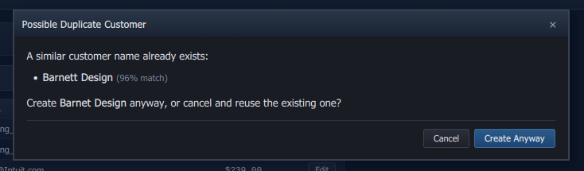

# Slowbooks Pro 2026

**A personal bookkeeping application "decompiled" from the ashes of QuickBooks 2003 Pro.**

Free and open source. Runs on Windows, macOS, and Linux. No Intuit activation servers required.

**Get started:** `docker compose up` — see **[INSTALL.md](INSTALL.md)** for all install options.




*Ships with both themes — toggle from the topbar or hit `Alt+D`. Choice persists in `localStorage`, so reloads stay in the theme you picked.*

---

## The Story

I ran QuickBooks 2003 Pro for 14 years for side business invoicing and bookkeeping. Then the hard drive died. Intuit's activation servers have been dead since ~2017, so the software can't be reinstalled. The license I paid for is worthless.

So I built my own replacement. I transferred all my data from the old .QBW file using IIF export/import.

The codebase is annotated with "decompilation" comments referencing `QBW32.EXE` offsets, Btrieve table layouts, and MFC class names — a tribute to the software that served me well for 14 years before its maker decided it should stop working.

**This is a clean-room reimplementation.** No Intuit source code was available or used.

---

## What's New

**Full payroll & HR module** — Onboarding checklists, time tracking, PTO policies and requests, deductions (401k, health, HSA), court-ordered garnishments, W-2/W-3/940/941 generation, and a token-accessed employee self-service portal for pay stubs, W-4 updates, direct-deposit setup, and time-off requests.

**Analytics dashboard + AI Insights** — KPI cards plus four charts (12-month revenue line, expenses doughnut, A/R+A/P stacked bar, 90-day cash forecast), MTD/QTD/YTD period selector, CSV/PDF export with branded headers. Optional one-shot executive brief and 11 curated predefined analyses via bring-your-own-key for any of seven providers (xAI Grok, Groq, Cloudflare Workers AI, Anthropic Claude, OpenAI, Google Gemini); keys encrypted at rest.

**Inventory & reporting** — Perpetual-inventory ledger with weighted-average cost, automatic COGS journal entries, click-through drill-down on P&L and Balance Sheet rows, fuzzy duplicate detection on customer/vendor names, and Saved Reports for one-click reruns.

**Customer details popout + reseller permits** — Click a customer row for a single-screen details modal with addresses, autosaving notes, attached reseller permits, and recent invoices/payments. A standalone reseller-permit module tracks expiration, validates per-state formats (WA 9-digit, CA 9-12, TX 11), and one-click-opens the state's official lookup site in your default browser for verification — the verification trail (who, when) is stored locally.

**Hardened for production** — App-level HTTPS redirect + HSTS, Content-Security-Policy, Fernet at-rest encryption with versioned ciphertext (clean key rotation), portal token expiration (90-day idle + 1-year hard), Argon2id passwords, rate limiting on login and portal, and startup checks that fail hard on critical misconfig. See [docs/security-hardening.md](docs/security-hardening.md).

See [CHANGELOG.md](CHANGELOG.md) for the full release history.

---

## Wait — it does *that*?

A few things in here that aren't normal for self-hosted bookkeeping.

**Cryptographically tamper-evident tax forms.** Every W-2, W-3, Form 940, and Form 941 PDF carries a **SHA-256 content hash and an audit ID printed in the footer**. Hand the printout to an auditor and they can recompute the hash, look it up against the local `document_audits` chain, and confirm the form hasn't been edited since you generated it. Not a watermark — a verification trail.

**Bring-your-own-AI, including your own gateway.** AI Insights and 11 predefined analyses run against any of seven providers (xAI Grok, Groq, Cloudflare Workers AI, Anthropic Claude, OpenAI, Google Gemini) — or against a **Cloudflare Worker you host yourself**, so the prompt never leaves infrastructure you control. API keys are encrypted at rest with Fernet under a **versioned ciphertext you can rotate without downtime**.



**One-click reseller-permit verification.** Type a customer's permit number — we validate the per-state digit pattern inline (WA 9-digit, CA 9–12, TX 11). Click **Verify** and your default browser pops the state's official lookup page; whatever you decide gets stamped onto the customer record as a who-and-when verification trail. No fake API integration that breaks in six months — just the workflow done right, with the digital permit encrypted at rest and the expiration date on the dashboard reminder strip.

**Boots refuse to lie to you.** A startup self-check runs the wiring audit *before* uvicorn binds the port — if the JS bundle drifted from the Python routes (route renamed, container built off a stale checkout), the container fails to start instead of 404-ing mid-feature in production. CI runs the same check on every PR.

---

## What it does

Full feature catalog (250+ bullets across every module) lives in **[docs/features.md](docs/features.md)**. Highlights:

- **Accounts receivable** — Invoices, estimates, payments with multi-invoice allocation, credit memos, recurring schedules, batch payments, Quick Entry for paper backlogs.
- **Accounts payable** — Purchase orders, bills (with vendor default expense accounts), bill payments, AP aging.
- **Double-entry accounting** — Manual + auto journal entries, 50-account Chart of Accounts (Contractor template), closing-date enforcement, real-time balance updates, automatic audit log via SQLAlchemy event hooks.


- **Banking** — Bank register with running balance, deposits, credit-card charges, check printing (3-per-page), full reconciliation workflow, OFX/QFX import with FITID dedup.
- **Reports & tax** — P&L, Balance Sheet, A/R & A/P Aging, General Ledger, Sales Tax with pay-to-government flow, Customer Statements, Schedule C export.
- **Payroll & HR** — Full module with tax forms; see **[docs/payroll-hr-module.md](docs/payroll-hr-module.md)**.
- **Analytics + AI** — Real-time BI layer with 8 metrics and a 90-day cash forecast; optional BYOK AI Insights layer. Full feature reference in [docs/features.md](docs/features.md#analytics).
- **Inventory** — Perpetual-inventory ledger, automatic COGS, weighted-average cost, reorder points, valuation, manual adjustments.



- **Duplicate detection** — Fuzzy match on customer/vendor names (difflib ≥ 0.85 after normalizing case, punctuation, and business suffixes like "Inc"/"LLC"). The form shows the matched names + similarity %; you confirm-and-create-anyway or back out.



- **Online payments** — Stripe Checkout integration. See **[docs/setup-stripe.md](docs/setup-stripe.md)**.
- **QuickBooks Online sync** — OAuth + bidirectional sync. See **[docs/setup-qbo.md](docs/setup-qbo.md)**.
- **QB2003 interop** — IIF import/export with type-mapping, validation, and round-trip safety.

---

## Quick Start

### Docker (Windows, macOS, Linux)

```bash
git clone https://github.com/VonHoltenCodes/SlowBooks-Pro-2026.git
cd SlowBooks-Pro-2026
docker compose up
```

Open **http://localhost:3001**. PostgreSQL, migrations, and seed data are handled automatically.

For native installs (Linux + macOS), demo data, troubleshooting, and CORS / port-change recipes, see **[INSTALL.md](INSTALL.md)**.

For backups, restore, key rotation, and monitoring see **[docs/operations.md](docs/operations.md)**. For a production-launch checklist see **[docs/release-checklist.md](docs/release-checklist.md)**.

---

## Documentation

| Doc | Covers |
|-----|--------|
| [INSTALL.md](INSTALL.md) | Install / first-run / upgrade guide (Docker + native Linux/macOS) |
| [docs/features.md](docs/features.md) | Full feature catalog + API endpoint reference + IIF interoperability |
| [docs/development.md](docs/development.md) | Tech stack, project structure, contributor flow |
| [docs/data-model.md](docs/data-model.md) | Database schema — 55 tables |
| [docs/operations.md](docs/operations.md) | Backups, restore, key rotation, monitoring runbook |
| [docs/payroll-hr-module.md](docs/payroll-hr-module.md) | Payroll / HR — models, routes, UI pages, pending items |
| [docs/release-checklist.md](docs/release-checklist.md) | Production deployment checklist — secrets, TLS, backups, monitoring, pre-flight |
| [docs/tls-proxy-setup.md](docs/tls-proxy-setup.md) | How to put a real cert in front of Slowbooks (Caddy, nginx, Traefik) |
| [docs/security-hardening.md](docs/security-hardening.md) | Production-readiness security pass — what changed, why, and how it's tested |
| [docs/hipaa-compliance.md](docs/hipaa-compliance.md) | HIPAA Security Rule mapping — what aligns, what doesn't, honest gap list |
| [docs/wiring-audit.md](docs/wiring-audit.md) | Frontend ↔ backend disconnect audit methodology and findings |
| [docs/setup-qbo.md](docs/setup-qbo.md) | QuickBooks Online OAuth + sync setup |
| [docs/setup-stripe.md](docs/setup-stripe.md) | Stripe payment processing setup |
| [SECURITY.md](SECURITY.md) | Public security policy and responsible disclosure |
| [CONTRIBUTING.md](CONTRIBUTING.md) | Contributor flow |
| [CHANGELOG.md](CHANGELOG.md) | Release history |

---

## Tech Stack

Python 3.13 + FastAPI on PostgreSQL 17 (SQLite for tests) with SQLAlchemy 2.0 and Alembic migrations. Vanilla HTML/CSS/JS single-page app — no framework, no build step. WeasyPrint + Jinja2 for PDFs. Self-hosted Chart.js for analytics (no CDN; LAN-deployable). Stripe Checkout for online payments. python-quickbooks + intuit-oauth for QBO sync. Runs on port 3001 by default.

Full project layout in [docs/development.md](docs/development.md).

---

## License

**Source Available — Free for personal and enterprise use. No commercial resale.**

You can use, modify, and run Slowbooks Pro for any personal, educational, or internal business purpose. You cannot sell it or offer it as a paid service. See [LICENSE](LICENSE) for full terms.

---

## Acknowledgments

- 14 years of QuickBooks 2003 Pro (1 license, $199.95, 2003 dollars)
- IDA Pro and the reverse engineering community
- The Pervasive PSQL documentation that nobody else has read since 2005
- Every small business owner who lost software they paid for when activation servers died

---

## Contributors

- [VonHoltenCodes](https://github.com/VonHoltenCodes) — Creator
- [PNWImport](https://github.com/PNWImport) — Security hardening (auth, CORS, path traversal, atomic writes, non-root Docker, rate limiting), analytics engine, AI insights with 7-provider support, Cloudflare Worker gateway, inventory ledger, drill-down reports, fuzzy duplicate detection, saved reports, payroll/HR module, tax-form audit chain, reseller-permit module, customer details popout
- [jake-378](https://github.com/jake-378) — Backup UI fixes, report period selectors, invoice terms autofill, date validation fixes
- [WC3D](https://github.com/WC3D) — Jinja2 XSS security fix
