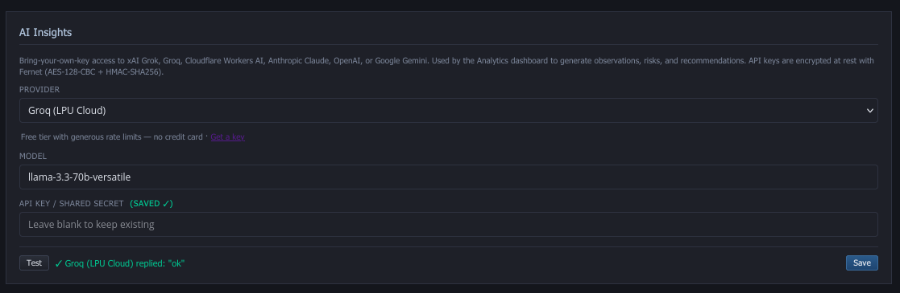

# Features

Full feature catalog for Slowbooks Pro 2026. The README keeps the
elevator pitch; everything an evaluator would scroll through lives
here.

For module-deep references (models, routes, UI pages, pending items),
see [docs/payroll-hr-module.md](payroll-hr-module.md) for payroll/HR,
[docs/security-hardening.md](security-hardening.md) for the security
pass, and the per-integration setup guides ([Stripe](setup-stripe.md),
[QuickBooks Online](setup-qbo.md), [TLS proxy](tls-proxy-setup.md)).

---

## Invoicing & Payments (Accounts Receivable)
- **Invoices** — Create, edit, duplicate, void, mark as sent, email as PDF. Auto-numbering, auto due-date from terms, dynamic line items with running totals. Print/PDF generation via WeasyPrint. Inline customer creation from invoice form
- **Estimates** — Full estimate workflow with convert-to-invoice (deep-copies all fields and line items). Inline customer creation from estimate form
- **Payments** — Record payments with allocation across multiple invoices. Auto-updates invoice balances and status (draft/sent/partial/paid). Void payments with reversing journal entries
- **Recurring Invoices** — Schedule automatic invoice generation (weekly/monthly/quarterly/yearly) with manual "Generate Now" or cron script
- **Batch Payments** — Apply payments to multiple invoices across multiple customers in a single transaction
- **Credit Memos** — Issue credits against customers, apply to invoices to reduce balance due. Proper reversing journal entries
- **Quick Entry Mode** — Batch invoice entry for paper invoice backlog. Save & Next (Ctrl+Enter) with running log


## Accounts Payable
- **Purchase Orders** — Non-posting documents to vendors with auto-numbering, convert-to-bill workflow
- **Bills** — Enter vendor bills (AP mirror of invoices). Track payables with status progression (draft/unpaid/partial/paid/void). Vendor default expense account pre-fill (account resolution: explicit → item → vendor default → global fallback)
- **Bill Payments** — Pay vendor bills with allocation. Journal: DR AP, CR Bank
- **AP Aging Report** — Outstanding payables grouped by vendor with 30/60/90 day buckets

## Double-Entry Accounting
- **Manual Journal Entries** — Full CRUD for manual journal entries with dynamic line rows, running debit/credit totals, balance indicator, and void with reversing entries
- **Auto Journal Entries** — Every invoice, payment, bill, and payroll run automatically creates balanced journal entries. Void creates reversing entries
- **Chart of Accounts** — 39+ seeded accounts (Contractor template), 6 account types (asset, liability, equity, income, COGS, expense)
- **Closing Date Enforcement** — Prevent modifications to transactions before a configurable closing date with optional password protection
- **Audit Log** — Automatic logging of all create/update/delete operations with old/new value tracking via SQLAlchemy event hooks
- **Account Balances** — Updated in real-time as transactions post

## Payroll & HR
- **Core payroll** — pay runs with federal/state/FICA withholding, balanced journal entries, pay stubs, YTD totals, encrypted ACH direct deposit, gross-up calculator, supplemental wages, multi-state withholding
- **HR** — 8-task onboarding checklist with e-signature, time tracking with approve/reject, PTO policies + requests with accrual draw-down, pre/post-tax deductions, court-ordered garnishments
- **Tax forms** — W-2, W-3, Form 940 (FUTA), Form 941 (FICA) endpoints. JSON for downstream integrations + WeasyPrint PDFs with tamper-evident audit hashes in the footer (SHA-256 + audit ID matched against the `document_audits` table).
- **Self-service portal** — token-accessed at `/portal/{token}` — pay stubs, W-4 updates, direct-deposit setup, PTO requests; branded with the employer's logo and company name

Tax calculations are approximate — verify with a tax professional. Full module reference (models, routes, UI pages, pending items) lives at [docs/payroll-hr-module.md](payroll-hr-module.md).

## Banking
- **Bank Accounts** — Register view with deposits and withdrawals
- **Check Register** — Filtered bank transaction view with running balance, payment/deposit columns, sorted by date
- **Make Deposits** — Move funds from Undeposited Funds to a bank account. Select pending payments, choose target account, create deposit
- **Credit Card Charges** — Enter credit card charges as expenses (DR Expense, CR Credit Card Payable). Dedicated charge entry form with vendor, amount, and expense category
- **Check Printing** — Generate check PDFs in standard 3-per-page format (stub/stub/check) with payee, amount in words, memo, and signature line
- **Bank Reconciliation** — Full workflow: enter statement balance, toggle cleared items, validate difference = $0, complete
- **OFX/QFX Import** — Import bank transactions from OFX/QFX files with FITID dedup, preview before import, auto-match by amount/date

## Reports & Tax
- **QuickBooks-style period selector** — All reports support preset periods (This Month, This Quarter, This/Last Year, Year to Date, Custom Date) with live refresh
- **Profit & Loss** — Income vs expenses for any date range
- **Balance Sheet** — Assets, liabilities, and equity as of any date
- **A/R Aging** — Outstanding receivables grouped by customer with 30/60/90 day buckets
- **A/P Aging** — Outstanding payables grouped by vendor with 30/60/90 day buckets
- **Sales Tax** — Tax collected by invoice with taxable/non-taxable breakdowns. Pay Sales Tax feature records payments to government (DR Sales Tax Payable, CR Bank)
- **General Ledger** — All journal entries grouped by account with debit/credit totals
- **Income by Customer** — Sales totals per customer with invoice counts
- **Customer Statements** — PDF statement with invoice/payment history and running balance
- **Schedule C (Tax)** — Generate Schedule C data from P&L with configurable account-to-tax-line mappings. Export as CSV

## Dashboard
- Company Snapshot with Total Receivables, Overdue Invoices, Active Customers, Total Payables
- **AR Aging Bar Chart** — Color-coded stacked bar (Current/30/60/90+ days)
- **Monthly Revenue Trend** — Bar chart showing last 12 months of invoiced revenue
- Recent invoices and payments tables
- Bank balances at a glance


## Analytics

Real-time business intelligence layer that sits on top of the accounting engine. Powered by `AnalyticsEngine` (`app/services/analytics.py`) with 8 aggregation methods and 7 REST endpoints at `/api/analytics/*`. **Fully integrated inline** into the main SPA as a hash-routed page — no separate shell, no full page reload. Click **Analytics** in the sidebar (under Accounting → Reports → Analytics → Tax Reports) to land on `#/analytics`.

**Metrics computed:**
- **Revenue by Customer** — Paid revenue per customer for the selected period, ranked high-to-low
- **12-Month Revenue Trend** — Monthly paid-revenue history with proper calendar-month bucketing
- **Expenses by Category** — Paid-bill expenses grouped by expense account number
- **A/R Aging** — Open invoice balances bucketed Current / 30 / 60 / 90+ days old, using `invoices.balance_due` so partial payments don't double-count. Table is sorted worst-offender first and includes a TOTAL row.
- **A/P Aging** — Open bill balances bucketed Current / 30 / 60 / 90+ days old (same treatment as A/R)
- **DSO (Days Sales Outstanding)** — `(open A/R balance ÷ last-30-day paid revenue) × 30`
- **90-Day Cash Forecast** — 14 weekly cumulative buckets of expected A/R collections vs A/P payments due on-or-before each cutoff. Net column color-coded green/red.
- **Customer Profitability** — Lifetime paid revenue per customer (first pass; COGS attribution on the roadmap)

**Dashboard UI (`#/analytics`, inline SPA page):**
- **4 KPI cards** — Revenue, Expenses, DSO, Margin%
- **Chart.js visualizations** (self-hosted 206 KB UMD bundle at `/static/js/chart.umd.js` — no CDN, LAN-deployable):
  - Revenue trend — 12-month line chart with filled area + hover tooltips
  - Expenses by category — doughnut chart with legend
  - A/R aging — horizontal stacked bar chart (one bar per customer, stacks = current/30/60/90)
  - A/P aging — horizontal stacked bar chart (one bar per vendor)
  - Cash forecast — dual-line (collections vs payments) + net bar chart overlay
- **Detail tables** under every chart with sort-by-total-descending and TOTAL footer rows
- **Period selector** — Dropdown for Month / Quarter / Year to Date; re-fetches dashboard + re-builds all charts instantly
- **Refresh button** — Re-fetch without navigating away
- **Export CSV** — Downloads flat CSV of the current snapshot at `/api/analytics/export.csv?period=...`
- **Export PDF** — Downloads a print-optimized PDF rendered by WeasyPrint (same dep used for invoice PDFs)
- **Theme-aware** — All Chart.js text/grid colors read from `<html data-theme>` so the charts flip with the main SPA theme toggle

**Date-range filtering (all endpoints):**
```
?period=month|quarter|year          (also accepts mtd/qtd/ytd)
?start_date=YYYY-MM-DD&end_date=YYYY-MM-DD    (explicit override)
```
Unknown period names and missing params fall back to month-to-date. Explicit dates take precedence over named periods.

**CSV export:**
```bash
curl 'http://localhost:3001/api/analytics/export.csv?period=year' -o analytics.csv
```
Flat CSV with columns `(section, key, subkey, value)` covering 9 sections: period, revenue_by_customer, revenue_trend, expenses_by_category, ar_aging, ap_aging, dso, cash_forecast, customer_profit. Drops straight into Excel / Google Sheets / any BI tool.

### AI Insights
An optional LLM layer sits on top of the analytics snapshot and produces a compact **3 observations / 3 risks / 3 recommendations** executive brief. Nothing is sent until you click the **AI Insights** button — the feature is zero-cost by default.

**Seven providers supported out of the box** (verified April 2026):

| Provider | Wire format | Default model | Free tier |
|---|---|---|---|
| **xAI Grok** | OpenAI-compat | `grok-4-fast` | $25 signup credit |
| **Groq (LPU Cloud)** | OpenAI-compat | `llama-3.3-70b-versatile` | Generous free tier, no card |
| **Cloudflare Workers AI** | OpenAI-compat | `@cf/meta/llama-3.3-70b-instruct-fp8-fast` | 10k neurons/day, no card |
| **Cloudflare Worker Gateway** (self-hosted) | OpenAI-compat | `@cf/meta/llama-3.3-70b-instruct-fp8-fast` | Same 10k neurons/day — **your keys stay in *your* Cloudflare account** |
| **Anthropic Claude** | `/v1/messages` | `claude-sonnet-4-6` | Paid only |
| **OpenAI** | `/v1/chat/completions` | `gpt-5.4-mini` | Paid only |
| **Google Gemini** | `generateContent` | `gemini-2.5-flash` | Free Flash tier via AI Studio |

Each provider's model string is configurable from **Settings → AI Insights** — a curated dropdown per provider with a **Custom…** escape hatch for new model IDs the vendors ship between releases. So renames ("gemini-2.5-flash" → "gemini-3.0-nano") are a Custom-field entry, not a code change. Cloudflare gets an extra field for your account ID since its endpoint is account-scoped. The dedicated **Cloudflare Worker Gateway** provider adds a second field for your Worker URL — see the self-hosted gateway section below.



> **Verified providers as of v2.0.0:** Only **Groq** has been validated end-to-end against a live key (both the AI Insights button and the predefined-analysis dropdown). The other six providers' wire formats are implemented and unit-tested but have not been exercised against live credentials. **Accepting working PRs that confirm or fix any provider's config** — open an issue or PR with provider name, working model ID, and any quirks discovered (e.g., headers, payload shape, error mapping).

**Settings encryption.** API keys are stored in the `settings` table under `ai_api_key`, encrypted with **Fernet** (AES-128-CBC + HMAC-SHA256) via `app/services/crypto.py`. Ciphertext rows carry the prefix `fernet:v1:` so legacy plaintext rows are detected and migrated gracefully. The master key is resolved in priority order:

1. `SETTINGS_ENCRYPTION_KEY` environment variable (ops-preferred)
2. `.slowbooks-master.key` file next to the repo (zero-config default; auto-created at 0600)
3. Fresh generation on first run (logged as a warning)

**Never commit `.slowbooks-master.key`** — it is in `.gitignore`. Losing it means losing every encrypted secret.

`GET /api/analytics/ai-config` returns `{provider, model, cloudflare_account_id, worker_url, has_api_key, api_key_encrypted, providers}` — the raw key is **never** in the response body. `PUT /api/analytics/ai-config` accepts a Pydantic `AIConfigUpdate` model — `{provider, model, cloudflare_account_id, worker_url, api_key}` — so malformed payloads are rejected with a 422 before they reach the service layer. An empty/missing `api_key` is interpreted as "keep the existing encrypted value", so re-saving the provider won't clobber the stored key.

**Endpoints:**
- `GET  /api/analytics/ai-config` — read display config (no secrets)
- `PUT  /api/analytics/ai-config` — update provider/model/key/account_id (key is encrypted on save)
- `POST /api/analytics/ai-config/test` — one-word smoke test against the configured provider
- `POST /api/analytics/ai-insights?period=month|quarter|year[&force=true]` — run the full dashboard analysis; results are cached in-process for 10 minutes per `(provider, model, period)`, unless `force=true`

All calls go through a **hardened** `httpx.Client` with a 60-second timeout, `verify=True` (TLS cert validation), `follow_redirects=False` (no sneaky 302-to-metadata tricks), and a minimal `User-Agent`. Error messages redact the API key before raising, so logs and 502 responses never leak your secret.

**Security hardening (April 2026 external audit pass):**
- **SSRF guard #1** — Cloudflare account IDs must match `^[a-f0-9]{32}$` (regex enforced both at request-build time and in `PUT /ai-config`)
- **SSRF guard #2** — `validate_worker_url()` in `app/services/ai_service.py` rejects plain `http://`, embedded credentials, localhost, `127.0.0.1`, all RFC1918 private ranges, link-local (`169.254.x.x` including the AWS metadata endpoint), multicast, and reserved blocks. URLs are capped at 2048 chars
- **MITM protection** — `verify=True`, `follow_redirects=False`, HTTPS-only enforcement on the Worker URL
- **CSV formula injection** — `_csv_safe()` in `export_csv()` prefixes any user-controlled cell starting with `=`, `+`, `-`, `@`, `\t`, or `\r` with a leading apostrophe before writing to CSV, neutralizing Excel/Sheets formula execution
- **Request schema validation** — `PUT /ai-config` uses a Pydantic `AIConfigUpdate` model instead of a raw `dict`, so malformed payloads are rejected with a 422 before they reach the service layer
- **Constant-time secret compare** — the shared-secret auth in `cloudflare/worker.js` uses a byte-wise constant-time compare instead of `===`, closing timing side-channels

### Self-hosted Cloudflare Worker Gateway (per-LAN-owner)

For installations where you don't want **any** AI credentials stored inside Slowbooks (even encrypted), the `cloudflare/` directory ships a minimal Worker that you deploy to **your own** Cloudflare account. Slowbooks only ever holds a shared secret scoped to your one Worker, so dumping the SQLite file doesn't expose enough to talk to Workers AI as you.

**What it buys you:**
- **Your keys never touch Slowbooks' DB.** Workers AI is accessed via the `env.AI.run()` binding — no Cloudflare API token is stored anywhere, in Slowbooks or in the Worker source
- **Per-installation isolation.** Every LAN owner installs their own Worker in their own Cloudflare account. One compromised install can't reach another; one abused install can't burn someone else's quota
- **Free tier friendly.** Cloudflare gives every account 10,000 neurons/day for free — plenty for hundreds of AI Insights runs and tool-calling Q&A sessions
- **Bearer-token auth.** Slowbooks sends `Authorization: Bearer <shared-secret>`; the Worker compares it against `env.AUTH_TOKEN` in constant time and rejects anything else with a 401
- **OpenAI wire format.** The Worker translates Workers AI's native response into OpenAI-shaped JSON (including `tool_calls`) so Slowbooks' existing OpenAI-compat code path works unchanged

**5-minute setup:** `wrangler login` → `openssl rand -hex 32` → `wrangler secret put AUTH_TOKEN` → `wrangler deploy` → paste the Worker URL + shared secret into Slowbooks **⚙ AI** → Provider: **Cloudflare Worker Gateway (self-hosted)**. Full step-by-step in **[cloudflare/README.md](../cloudflare/README.md)**.

**What it does *not* protect against:** a compromised Slowbooks install still has the shared secret, so it can still invoke *your* Worker — rotate the secret if you suspect compromise; abnormal Worker traffic shows up in the Cloudflare dashboard immediately.

### AI Predefined Analyses

Beyond the headline insights brief, the analytics page exposes a **curated dropdown of 11 predefined analyses** spanning the full ledger surface. Each action pre-fetches its data server-side via the existing `app/services/ai_tools.py` helpers and sends a focused **one-shot** prompt to the LLM (no tool calling, no multi-turn). This avoids the brittle "model emits legacy `<function=...>` syntax" path that some Llama-on-Groq combos still hit, so it works reliably across every provider.


**Categories and actions** (registered in `app/services/ai_actions.py`):

| Category | Action | Tool used |
|---|---|---|
| **Customers & Sales** | Top customers by revenue | `get_sales_by_customer` |
| | Unpaid invoices summary | `search_invoices` |
| | A/R aging | `get_aging_report` |
| **Vendors & Bills** | Expenses by category | `get_expenses_by_category` |
| | Unpaid bills summary | `search_bills` |
| | A/P aging | `get_aging_report` |
| **Banking & Cash** | Cash position by account | `list_accounts` + `get_account_balance` |
| | Recent payment activity | `search_payments` |
| **Financial Reports** | P&L analysis | `get_pl_summary` |
| | Balance sheet analysis | `get_balance_sheet` |
| **Tax** | Sales tax position | `get_tax_summary` |

The page-level period selector (MTD / QTD / YTD) flows through to date-bounded actions automatically; "as of today" actions ignore it. Adding a new action is a single `ActionSpec` registration — point it at one of the existing tool functions and define a one-line framing prompt.

**Endpoints:**
- `GET  /api/analytics/ai-actions` — list catalogue grouped by category
- `POST /api/analytics/ai-actions/{key}?period=…` — run one analysis; returns `{action_key, label, category, analysis, data, provider, model, period}`

The 16 underlying read-only tool functions in `ai_tools.py` are still available (and unit-tested) for any future code path that wants tool calling. The **`POST /api/analytics/ai-query`** endpoint that drove the legacy chat panel is retained as a power-user API but is no longer wired into the UI.

**PDF export:**
```bash
curl 'http://localhost:3001/api/analytics/export.pdf?period=year' -o analytics.pdf
```
Print-ready PDF via WeasyPrint + Jinja2 (`app/templates/analytics_pdf.html` → `app/services/pdf_service.py::generate_analytics_pdf`). Same template handles all periods. Output: letter-size, page numbers in footer, KPI strip + every table the UI shows. ~18 KB typical for a small business; renders in WeasyPrint in well under a second.

**Performance:** `GET /api/analytics/dashboard` issues exactly **10 SQL queries** regardless of dataset size — every method is single-query (or at most two) with no N+1 relationship loads. Measured on SQLite with 3,000 invoices + 1,500 bills: **~26 ms** engine / ~40 ms full HTTP round-trip; with 8,000 invoices + 4,000 bills: **~50 ms**. The `period` parameter adds zero extra queries. PDF export renders end-to-end in ~100 ms on the medium dataset.

Quick smoke test once the app is running:
```bash
curl http://localhost:3001/api/analytics/dashboard
curl http://localhost:3001/api/analytics/dashboard?period=year
curl http://localhost:3001/api/analytics/export.csv > snapshot.csv
curl http://localhost:3001/api/analytics/export.pdf > snapshot.pdf
```

## Online Payments
- **Stripe Checkout** — Accept online payments via Stripe's hosted checkout page. Customers click "Pay Online" in emailed invoices, pay on Stripe, and the payment auto-records with journal entries (DR Undeposited Funds, CR A/R)
- **Public Payment Page** — Standalone `/pay/{token}` page (no login required) shows invoice summary with "Pay with Stripe" button. Supports light/dark mode
- **Copy Payment Link** — One-click copy of the public payment URL from the invoice view modal
- **Webhook Handler** — Idempotent Stripe webhook processes `checkout.session.completed` events with signature verification
- **Setup Guide** — See [docs/setup-stripe.md](setup-stripe.md)

## QuickBooks Online Integration
- **OAuth 2.0** — Connect to QuickBooks Online via Intuit's OAuth Authorization Code flow with automatic token refresh
- **Import from QBO** — Pull accounts, customers, vendors, items, invoices, and payments from QBO with dependency-ordered import and duplicate detection
- **Export to QBO** — Push Slowbooks data to QBO with entity type mapping and ID tracking
- **ID Mapping** — `qbo_mappings` table tracks QBO ID ↔ Slowbooks ID per entity for dedup and re-sync
- **Setup Guide** — See [docs/setup-qbo.md](setup-qbo.md)


## Communication & Export
- **Invoice Email** — Send invoices as PDF attachments via SMTP with configurable email settings. Includes "Pay Online" button when Stripe is enabled
- **CSV Import/Export** — Import/export customers, vendors, items, invoices, and chart of accounts as CSV
- **Print Preview** — Browser print dialog for invoices and estimates via dedicated HTML preview endpoints. Native OS print dialog with "Save as PDF" option
- **Print-Optimized PDF** — Enhanced invoice PDF template with company logo support
- **IIF Import/Export** — Full QuickBooks 2003 Pro interoperability (see below)

## Inventory, Drill-Down & Duplicate Detection


- **Real inventory tracking** — Items can be marked `track_inventory=True` to hit a perpetual-inventory ledger. Every purchase (bill) and sale (invoice) writes a row to `inventory_movements` and updates `quantity_on_hand` + weighted-average `avg_cost`
- **Automatic COGS journal entries** — Selling an inventory item posts `DR COGS / CR Inventory Asset` at the current weighted-avg cost. Voids reverse the entry
- **Weighted-average cost** — Standard perpetual-inventory model: `new_avg = (old_qty × old_avg + received_qty × received_cost) / (old_qty + received_qty)`
- **Reorder points + low-stock report** — `GET /api/items/low-stock` returns items at or below their reorder point, worst-shortage first
- **Inventory valuation** — `GET /api/items/valuation` sums `qty × avg_cost` across all tracked items
- **Manual adjustments** — `POST /api/items/{id}/adjust` for count corrections, shrinkage, spoilage with an offsetting JE to #5900 (Inventory Adjustments) or COGS
- **Drill-down reporting** — `GET /api/reports/account-transactions?account_id=X` returns every journal entry hitting an account in the date range, with source-doc links (`/#/invoices/42`, `/#/bills/17`, etc.) so the SPA can jump from a P&L row to the underlying transaction
- **Fuzzy duplicate detection** — Customer/vendor creation warns with 409 on similar names (difflib similarity ≥ 0.85 after normalizing case, punctuation, and business suffixes like "Inc", "LLC", "Corp"). The form shows a confirm-and-create-anyway dialog with the matched names + similarity %; pass `?force=true` to override programmatically, or use `GET /api/customers/check-duplicate?name=...` for a pre-submit preview


- **Saved reports** — Full CRUD on named `(report_type, parameters)` tuples at `/api/saved-reports`. Lets users one-click rerun their favorite P&L, Balance Sheet, or account drill-down without re-entering dates

## Security & Authentication
- Single-user authentication with Argon2id password hashing and rate-limited login
- App-level HTTPS redirect, HSTS, and `Secure` session cookie when `FORCE_HTTPS=true`
- Field-level Fernet encryption for bank routing/account numbers, with zero-downtime key rotation
- Self-service portal tokens expire on 90-day idle + 1-year hard windows
- Startup checks fail hard if production config is missing TLS, encryption secret, or HTTPS

Canonical list of security measures lives in [SECURITY.md](../SECURITY.md); engineering log of the hardening pass is at [docs/security-hardening.md](security-hardening.md).

## System & Administration
- **Dark Mode** — Toggle between QB2003 Blue theme and dark mode (Alt+D or toolbar button). Persists in localStorage
- **Backup/Restore** — Create and download PostgreSQL backups from the settings page
- **Multi-Company** — Support for multiple company databases, switchable from UI
- **Global Search** — Unified server-side search across customers, vendors, items, invoices, estimates, and payments
- **Attachments** — Upload files (PDF, images) to invoices, bills, and other entities with MIME type and extension validation
- **Bank Rules** — Auto-categorize imported bank transactions with pattern-matching rules
- **Budgets** — Create and track budgets by account and period with actual-vs-budget comparison
- **Email Templates** — Customizable email templates for invoices, estimates, and statements

## UI
- Authentic QB2003 "Default Blue" skin with navy/gold color palette (+ dark mode)
- Splash screen with build info and decompilation provenance
- Windows XP-era toolbar, sidebar navigator with icons, status bar
- Keyboard shortcuts: `Alt+N` (new invoice), `Alt+P` (payment), `Alt+Q` (quick entry), `Alt+H` (home), `Alt+D` (dark mode), `Ctrl+S` (save modal form), `Ctrl+K` (search), `Escape` (close modal)
- No frameworks — vanilla HTML/CSS/JS single-page app
- 35+ SPA routes, 34 sidebar nav links


## QuickBooks 2003 Pro Interoperability
- **IIF Export** — Export all Slowbooks data (accounts, customers, vendors, items, invoices, payments, estimates) as .iif files importable into QB2003 via File > Utilities > Import > IIF Files
- **IIF Import** — Parse and import .iif files exported from QB2003 with duplicate detection and per-row error handling
- **Validation** — Pre-flight validation of .iif files before import (checks structure, account types, balanced transactions)
- **Date Range Filtering** — Export invoices and payments for specific date ranges
- **Round-Trip Safe** — Export from Slowbooks, re-import into Slowbooks — deduplication prevents double-entry

Full IIF format reference, account-type mapping, and round-trip examples live in the [QuickBooks 2003 Interop](#quickbooks-2003-pro-iif-interoperability) section below.

## Utilities
- **Backup Script** — `scripts/backup.sh` — pg_dump with gzip compression, keeps last 30 backups
- **Recurring Invoice Cron** — `scripts/run_recurring.py` — Standalone script for generating due recurring invoices
- **IRS Mock Data** — `scripts/seed_irs_mock_data.py` — Seeds realistic test data from IRS Publication 583 (Henry Brown's Auto Body Shop: 8 customers, 13 vendors, 10 invoices, 5 payments, 3 estimates)

---

## QuickBooks 2003 Pro — IIF Interoperability

Slowbooks can exchange data with QuickBooks 2003 Pro via **Intuit Interchange Format (IIF)** — a tab-delimited text format that QB2003 uses for file-based import/export.


### Exporting from Slowbooks to QB2003

1. Navigate to **QuickBooks Interop** in the sidebar
2. Click **Export All Data** (or export individual sections)
3. For invoices/payments, optionally set a date range
4. Save the `.iif` file
5. In QuickBooks 2003: **File > Utilities > Import > IIF Files** and select the file

**What gets exported:**

| Section | IIF Header | Fields |
|---------|-----------|--------|
| Chart of Accounts | `!ACCNT` | Name, type (BANK/AR/AP/INC/EXP/EQUITY/COGS/etc.), number, description |
| Customers | `!CUST` | Name, company, address, phone, email, terms, tax ID |
| Vendors | `!VEND` | Name, address, phone, email, terms, tax ID |
| Items | `!INVITEM` | Name, type (SERV/PART/OTHC), description, rate, income account |
| Invoices | `!TRNS/!SPL` | Customer, date, line items, amounts, tax, terms |
| Payments | `!TRNS/!SPL` | Customer, date, amount, deposit account, invoice allocation |
| Estimates | `!TRNS/!SPL` | Customer, date, line items (non-posting) |

### Importing from QB2003 to Slowbooks

1. In QuickBooks 2003: **File > Utilities > Export > Lists to IIF Files**
2. In Slowbooks: navigate to **QuickBooks Interop**
3. Drag and drop the `.iif` file (or click to browse)
4. Click **Validate** — checks structure, account types, and balanced transactions
5. If validation passes, click **Import**

The importer handles:
- Automatic account type mapping (QB's 14 types → Slowbooks' 6 types)
- Parent:Child colon-separated account names
- Duplicate detection (skips records that already exist by name or document number)
- Per-row error collection (a bad row won't abort the entire import)
- Windows-1252 and UTF-8 encoded files

### IIF Format Reference

IIF is tab-delimited with `\r\n` line endings. Header rows start with `!`. Transaction blocks use `TRNS`/`SPL`/`ENDTRNS` grouping. Sign convention: TRNS amount is positive (debit), SPL amounts are negative (credits), and they must sum to zero.

```
!TRNS	TRNSTYPE	DATE	ACCNT	NAME	AMOUNT	DOCNUM
!SPL	TRNSTYPE	DATE	ACCNT	NAME	AMOUNT	DOCNUM
!ENDTRNS
TRNS	INVOICE	01/15/2026	Accounts Receivable	John E. Marks	444.96	2001
SPL	INVOICE	01/15/2026	Service Income	John E. Marks	-438.00	2001
SPL	INVOICE	01/15/2026	Sales Tax Payable	John E. Marks	-6.96	2001
ENDTRNS
```

### Account Type Mapping

| Slowbooks Type | IIF Types (by account number range) |
|---------------|--------------------------------------|
| Asset | `BANK` (1000-1099), `AR` (1100), `OCASSET` (1101-1499), `FIXASSET` (1500-1999) |
| Liability | `AP` (2000), `OCLIAB` (2001-2499), `LTLIAB` (2500+) |
| Equity | `EQUITY` |
| Income | `INC` |
| Expense | `EXP` |
| COGS | `COGS` |

### Sample Data

The `scripts/seed_irs_mock_data.py` script populates Slowbooks with test data from **IRS Publication 583** (Rev. December 2024) — "Starting a Business and Keeping Records." The sample business is **Henry Brown's Auto Body Shop**, a sole proprietorship with:

- 8 customers (John E. Marks, Patricia Davis, Robert Garcia, Thompson & Sons, etc.)
- 13 vendors from the IRS check disbursements journal (Auto Parts Inc., ABC Auto Paint, Baker's Fender Co., etc.)
- 8 service/material items (Body Repair, Paint & Finish, Dent Removal, Frame Alignment, etc.)
- 10 invoices totaling $3,631.31 with 1.59% sales tax
- 5 payments totaling $1,498.00
- 3 pending estimates
- All with proper double-entry journal entries

```bash
python3 scripts/seed_irs_mock_data.py
```

---

## API reference

All endpoints under `/api/`. Swagger docs at `/docs`. 300+ routes across 50 routers. All routes (except `/api/auth/*`, `/health`, `/pay/*`, and `/api/stripe/webhook`) require an authenticated session.

### Authentication
| Endpoint | Methods | Description |
|----------|---------|-------------|
| `/api/auth/status` | GET | Auth state: `{setup_needed, authenticated}` |
| `/api/auth/setup` | POST | First-run password setup (min 8 chars) |
| `/api/auth/login` | POST | Login with password |
| `/api/auth/logout` | POST | Clear session |

### Core (Original)
| Endpoint | Methods | Description |
|----------|---------|-------------|
| `/api/dashboard` | GET | Company snapshot stats |
| `/api/dashboard/charts` | GET | AR aging buckets + monthly revenue trend |
| `/api/settings` | GET, PUT | Company settings |
| `/api/settings/test-email` | POST | Send SMTP test email |
| `/api/search` | GET | Unified search across all entities |
| `/api/accounts` | GET, POST, PUT, DELETE | Chart of Accounts CRUD |
| `/api/customers` | GET, POST, PUT, DELETE | Customer management |
| `/api/vendors` | GET, POST, PUT, DELETE | Vendor management |
| `/api/items` | GET, POST, PUT, DELETE | Items & services |
| `/api/invoices` | GET, POST, PUT | Invoice CRUD with line items |
| `/api/invoices/{id}/pdf` | GET | Generate invoice PDF |
| `/api/invoices/{id}/void` | POST | Void with reversing journal entry |
| `/api/invoices/{id}/send` | POST | Mark invoice as sent |
| `/api/invoices/{id}/email` | POST | Email invoice as PDF attachment |
| `/api/invoices/{id}/duplicate` | POST | Duplicate invoice as new draft |
| `/api/invoices/{id}/print-preview` | GET | Browser print preview (HTML) |
| `/api/estimates` | GET, POST, PUT | Estimate CRUD with line items |
| `/api/estimates/{id}/convert` | POST | Convert estimate to invoice |
| `/api/estimates/{id}/print-preview` | GET | Browser print preview (HTML) |
| `/api/payments` | GET, POST | Record payments with invoice allocation |
| `/api/payments/{id}/void` | POST | Void payment with reversing journal entry |
| `/api/banking/accounts` | GET, POST, PUT | Bank account management |
| `/api/banking/transactions` | GET, POST | Bank register entries |
| `/api/banking/reconciliations` | GET, POST | Reconciliation sessions |

### Accounts Payable
| Endpoint | Methods | Description |
|----------|---------|-------------|
| `/api/purchase-orders` | GET, POST, PUT | Purchase order CRUD |
| `/api/purchase-orders/{id}/convert-to-bill` | POST | Convert PO to bill |
| `/api/bills` | GET, POST, PUT | Bill CRUD with line items |
| `/api/bills/{id}/void` | POST | Void bill |
| `/api/bill-payments` | POST | Pay vendor bills with allocation |
| `/api/credit-memos` | GET, POST | Credit memo CRUD |
| `/api/credit-memos/{id}/apply` | POST | Apply credit to invoices |

### Productivity
| Endpoint | Methods | Description |
|----------|---------|-------------|
| `/api/recurring` | GET, POST, PUT, DELETE | Recurring invoice templates |
| `/api/recurring/generate` | POST | Generate due recurring invoices |
| `/api/batch-payments` | POST | Batch payment application |

### Payroll & HR Core
| Endpoint | Methods | Description |
|----------|---------|-------------|
| `/api/employees` | GET, POST, PUT | Employee CRUD with W-4, address, hire date, work state |
| `/api/employees/{id}/ytd` | GET | Year-to-date totals (gross, taxes, deductions, net) |
| `/api/employees/{id}/portal-token` | GET, POST | Self-service portal token (no company password needed) |
| `/api/employees/{id}/bank-accounts` | GET, POST, DELETE | ACH direct deposit routing/account numbers (encrypted) |
| `/api/payroll` | GET, POST | Pay run CRUD |
| `/api/payroll/{id}/process` | POST | Process pay run (creates balanced journal entries) |
| `/api/payroll/{id}/nacha` | POST | Generate NACHA ACH file for direct deposit |

### Payroll & HR

All payroll, HR, tax-form, and self-service portal endpoints are documented with a complete method-and-path table in [docs/payroll-hr-module.md](payroll-hr-module.md).

### Banking & Deposits
| Endpoint | Methods | Description |
|----------|---------|-------------|
| `/api/banking/check-register` | GET | Check register with running balance |
| `/api/deposits/pending` | GET | Pending deposits in Undeposited Funds |
| `/api/deposits` | GET, POST | Create deposits (move funds to bank) |
| `/api/cc-charges` | GET, POST | Credit card charge entry |
| `/api/checks/print` | GET | Generate check PDF (3-per-page format) |

### Journal Entries
| Endpoint | Methods | Description |
|----------|---------|-------------|
| `/api/journal` | GET, POST | Manual journal entry CRUD |
| `/api/journal/{id}` | GET | Get journal entry with lines |
| `/api/journal/{id}/void` | POST | Void with reversing entry |

### Reports & Tax
| Endpoint | Methods | Description |
|----------|---------|-------------|
| `/api/reports/profit-loss` | GET | P&L report |
| `/api/reports/balance-sheet` | GET | Balance sheet |
| `/api/reports/ar-aging` | GET | Accounts receivable aging |
| `/api/reports/ap-aging` | GET | Accounts payable aging |
| `/api/reports/sales-tax` | GET | Sales tax collected |
| `/api/reports/sales-tax/pay` | POST | Record sales tax payment to government |
| `/api/reports/general-ledger` | GET | All journal entries by account |
| `/api/reports/income-by-customer` | GET | Sales totals per customer |
| `/api/tax/schedule-c` | GET | Schedule C data from P&L |
| `/api/tax/schedule-c/csv` | GET | Schedule C CSV export |

### Import/Export
| Endpoint | Methods | Description |
|----------|---------|-------------|
| `/api/iif/export/all` | GET | Export everything as .iif |
| `/api/iif/import` | POST | Import .iif file |
| `/api/csv/export/{type}` | GET | Export entities as CSV |
| `/api/csv/import/{type}` | POST | Import CSV file |
| `/api/bank-import/preview` | POST | Preview OFX/QFX transactions |
| `/api/bank-import/import/{id}` | POST | Import OFX/QFX into bank account |

### QuickBooks Online
| Endpoint | Methods | Description |
|----------|---------|-------------|
| `/api/qbo/auth-url` | GET | Generate Intuit OAuth authorization URL |
| `/api/qbo/callback` | GET | OAuth redirect handler (stores tokens) |
| `/api/qbo/disconnect` | POST | Clear stored QBO tokens |
| `/api/qbo/status` | GET | Connection status (never returns raw tokens) |
| `/api/qbo/import` | POST | Import all entity types from QBO |
| `/api/qbo/import/{entity}` | POST | Import single entity type |
| `/api/qbo/export` | POST | Export all entity types to QBO |
| `/api/qbo/export/{entity}` | POST | Export single entity type |

### Online Payments
| Endpoint | Methods | Description |
|----------|---------|-------------|
| `/pay/{token}` | GET | Public payment page (no auth) |
| `/api/stripe/create-checkout-session` | POST | Create Stripe Checkout session |
| `/api/stripe/webhook` | POST | Stripe webhook handler |
| `/api/stripe/payment-link/{id}` | GET | Get public payment URL for invoice |

### System
| Endpoint | Methods | Description |
|----------|---------|-------------|
| `/api/audit` | GET | Audit log viewer |
| `/api/backups` | GET, POST | Backup management |
| `/api/backups/{id}/download` | GET | Download backup file |
| `/api/companies` | GET, POST | Multi-company management |
| `/api/uploads/logo` | POST | Upload company logo |
| `/api/attachments/{type}/{id}` | GET, POST, DELETE | File attachments CRUD |
| `/api/bank-rules` | GET, POST, PUT, DELETE | Bank transaction categorization rules |
| `/api/budgets` | GET, POST, PUT, DELETE | Budget management |
| `/api/email-templates` | GET, POST, PUT, DELETE | Custom email template management |
| `/health` | GET | Liveness probe (no auth required) |

### Inventory
| Endpoint | Methods | Description |
|----------|---------|-------------|
| `/api/items/{id}/movements` | GET | Per-item inventory ledger (newest first) |
| `/api/items/{id}/adjust` | POST | Manual quantity adjustment with offsetting JE |
| `/api/items/low-stock` | GET | Items at or below their reorder point |
| `/api/items/valuation` | GET | Sum of `qty × avg_cost` across tracked items |

### Drill-Down & Saved Reports
| Endpoint | Methods | Description |
|----------|---------|-------------|
| `/api/reports/account-transactions` | GET | Every journal line hitting an account, with source-doc links |
| `/api/customers/check-duplicate` | GET | Pre-submit duplicate-name check (fuzzy) |
| `/api/vendors/check-duplicate` | GET | Pre-submit duplicate-name check (fuzzy) |
| `/api/saved-reports` | GET, POST | List/create named report parameter sets |
| `/api/saved-reports/{id}` | GET, PUT, DELETE | Saved report CRUD |

### Analytics
All read endpoints accept `?period=month|quarter|year` (or `mtd/qtd/ytd`), or explicit `?start_date=YYYY-MM-DD&end_date=YYYY-MM-DD`.

| Endpoint | Methods | Description |
|----------|---------|-------------|
| `/api/analytics/dashboard` | GET | Complete analytics snapshot (all 8 metrics, includes `period` echo) |
| `/api/analytics/revenue` | GET | Windowed revenue by customer + 12-month trend |
| `/api/analytics/expenses` | GET | Windowed expense breakdown by account number |
| `/api/analytics/cash-flow` | GET | Cash forecast + DSO + A/R and A/P aging (`?days=90`) |
| `/api/analytics/profitability` | GET | Lifetime paid revenue per customer |
| `/api/analytics/export.csv` | GET | Flat CSV of the full snapshot (`section,key,subkey,value`) — honors period params |
| `/api/analytics/export.pdf` | GET | Print-ready PDF via WeasyPrint — honors period params |
| `/api/analytics/ai-config` | GET, PUT | Display config (no raw key) / update provider/model/key/worker_url (key Fernet-encrypted at rest; worker_url validated against SSRF/MITM) |
| `/api/analytics/ai-config/test` | POST | Smoke-test the configured provider with a one-word prompt |
| `/api/analytics/ai-insights` | POST | Run the dashboard through the configured LLM; `?force=true` bypasses 10-min cache |
| `/api/analytics/ai-query` | POST | Tool-calling Q&A — LLM autonomously calls 16 read-only tools to answer `?question=...` |
| `/analytics` | GET | Backwards-compat 307 redirect to the SPA hash route `/#/analytics` |
